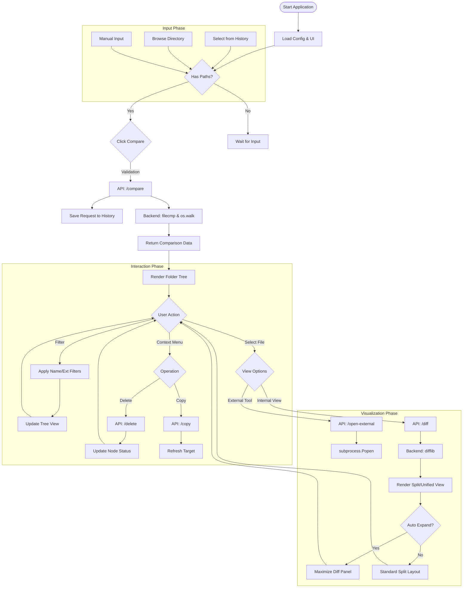

# Application Process Flowchart

This flowchart illustrates the complete user journey and internal logic decision points.

```mermaid
flowchart TD
    Start([Start Application]) --> Init[Load Config & UI]
    Init --> InputState
    
    subgraph Input Phase
        InputState{Has Paths?}
        History[Select from History] --> InputState
        Browse[Browse Directory] --> InputState
        Manual[Manual Input] --> InputState
    end
    
    InputState -- Yes --> Compare{Click Compare}
    InputState -- No --> Wait[Wait for Input]
    
    Compare -->|Validation| APICall[API: /compare]
    APICall --> SaveHistory[Save Request to History]
    APICall --> BackendComp[Backend: filecmp & os.walk]
    BackendComp --> ReturnJSON[Return Comparison Data]
    
    ReturnJSON --> RenderTree[Render Folder Tree]
    
    subgraph Interaction Phase
        RenderTree --> UserAction{User Action}
        
        UserAction -- Filter --> ApplyFilter[Apply Name/Ext Filters]
        ApplyFilter --> ReRender[Update Tree View]
        
        UserAction -- Select File --> CheckViewOpts{View Options}
        
        UserAction -- Context Menu --> Ops{Operation}
        Ops -- Delete --> APIDelete[API: /delete]
        Ops -- Copy --> APICopy[API: /copy]
        APIDelete --> UpdateStatus[Update Node Status]
        APICopy --> Refresh[Refresh Target]
    end
    
    subgraph Visualization Phase
        CheckViewOpts -- External Tool --> ExtLaunch[API: /open-external]
        ExtLaunch --> SysCall[subprocess.Popen]
        
        CheckViewOpts -- Internal View --> FetchDiff[API: /diff]
        FetchDiff --> CalcDiff[Backend: difflib]
        CalcDiff --> ShowDiff[Render Split/Unified View]
        
        ShowDiff --> CheckExpand{Auto Expand?}
        CheckExpand -- Yes --> ToggleFull[Maximize Diff Panel]
        CheckExpand -- No --> StandardView[Standard Split Layout]
    end
    
    UpdateStatus --> UserAction
    ReRender --> UserAction
    StandardView --> UserAction
    ToggleFull --> UserAction
```
