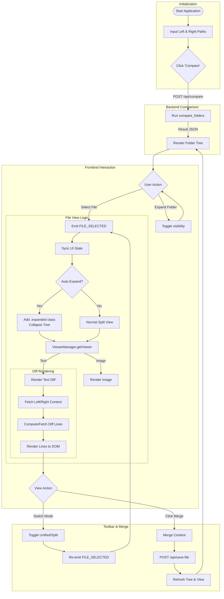

# Flowchart: User Journey & System Logic

This flowchart illustrates the complete user journey from starting the application to viewing and merging files, including internal logic triggers.

```mermaid
flowchart TD
    %% Nodes
    Start([Start Application])
    InputPaths[Input Left & Right Paths]
    CompareBtn{Click 'Compare'}
    
    subgraph Initialization
        Start --> InputPaths
        InputPaths --> CompareBtn
    end

    subgraph Comparison_Logic [Backend Comparison]
        CompareBtn -->|POST /api/compare| API_Compare[Run compare_folders]
        API_Compare -->|Result JSON| RenderTree[Render Folder Tree]
    end

    subgraph Interaction_Loop [Frontend Interaction]
        RenderTree --> UserAction{User Action}
        
        UserAction -- Expand Folder --> ToggleFolder[Toggle visibility]
        ToggleFolder --> UserAction
        
        UserAction -- Select File --> FileLogic[Emit FILE_SELECTED]
        
        subgraph File_Viewing [File View Logic]
            FileLogic --> UI_Sync[Sync UI State]
            UI_Sync --> AutoExpand{Auto-Expand?}
            
            AutoExpand -- Yes --> DOM_Expand[Add .expanded class\nCollapse Tree]
            AutoExpand -- No --> DOM_Normal[Normal Split View]
            
            DOM_Expand & DOM_Normal --> SelectViewer[ViewerManager.getViewer]
            
            SelectViewer -- Image --> ImageViewer[Render Image]
            SelectViewer -- Text --> DiffViewer[Render Text Diff]
            
            subgraph Diff_Process [Diff Rendering]
                DiffViewer --> FetchContent[Fetch Left/Right Content]
                FetchContent --> ComputeDiff[Compute/Fetch Diff Lines]
                ComputeDiff --> RenderHTML[Render Lines to DOM]
            end
        end
        
        RenderHTML --> ViewAction{View Action}
    end
    
    subgraph View_Actions [Toolbar & Merge]
        ViewAction -- Switch Mode --> ViewMode[Toggle Unified/Split]
        ViewMode --> ReTrigger[Re-emit FILE_SELECTED] --> FileLogic
        
        ViewAction -- Click Merge --> MergeLogic[Merge Content]
        MergeLogic --> API_Save[POST /api/save-file]
        API_Save --> Refresh[Refresh Tree & View]
        Refresh --> RenderTree
    end
```
