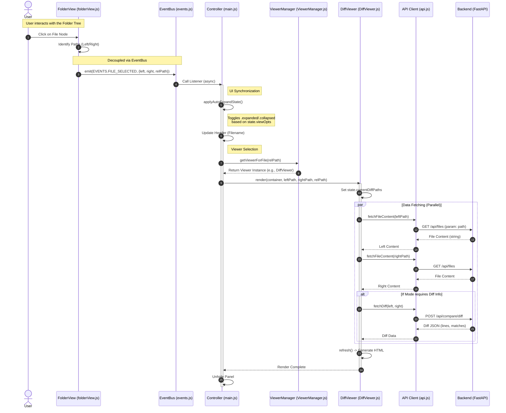
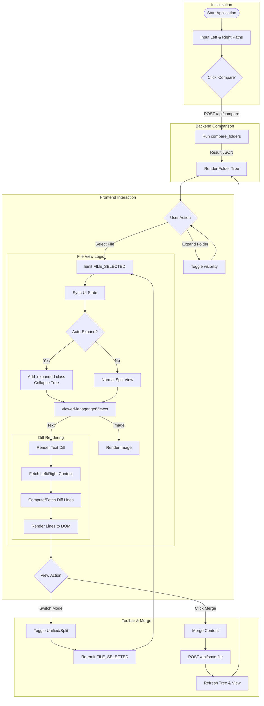

# Project Status & Handover Documentation

## 1. Project Overview
**Folder Comparison Tool (J-Folder Merge)** is a web-based application for comparing directory structures and file contents. It features a modern, dark-themed UI, split-view file comparison, and integration with external tools.

## 2. Key Implemented Features
### Backend (FastAPI)
- **Directory Comparison**: Recursive comparison using `filecmp` logic.
- **File Operations**: API endpoints for `copy`, `delete`, `save` (content update).
- **History Management**: Stores last 10 comparison paths in `settings/history.json`.
- **External Tooling**: Launches `meld`, `code`, or `opendiff` for selected files.
- **Static Serving**: Serves the frontend application.

### Frontend (Vanilla JS + Modules)
- **Event-Driven Architecture**: Uses `EventBus` to decouple `main.js`, `folderView.js`, and `diffView.js`.
- **UI Components**:
  - **Tree View**: Color-coded file status (Added, Removed, Modified).
  - **Split Diff View**: Side-by-side code comparison.
  - **Input Group**: Integrated Path Input + History + Browse buttons.
- **View Options**:
  - **Default**: Standard split view.
  - **Auto-Expand**: Automatically full-screens the diff view on file selection.
  - **External Tool**: Opens the selected file pair in an external application.
- **History**: Modals to select previously used Left/Right paths.

## 3. System Architecture

### Sequence Diagram: File Selection & Viewing Flow


### Flowchart: User Journey & System Logic


## 4. Current File Structure
```
FolderComp/
├── backend/
│   ├── main.py        # FastAPI Entry Point
│   ├── models.py      # Pydantic Models
│   ├── core/
│   │   ├── comparator.py # Directory Logic
│   │   └── differ.py     # File Diff Logic
│   └── routers/       # (Prepared) Route Separation
├── frontend/
│   ├── index.html     
│   ├── style.css      
│   └── js/
│       ├── main.js       # Controller
│       ├── api.js        # API Client
│       ├── state.js      # Global Store
│       ├── events.js     # Event Bus
│       ├── folderView.js # Tree View Logic
│       ├── browseModal.js
│       └── viewers/      # Pluggable Viewers
│           ├── ViewerManager.js
│           ├── DiffViewer.js
│           └── ImageViewer.js
└── settings/
    ├── history.json
    └── config.json
```

## 5. Next Steps (Recommended)
1.  **Refactoring**: Continue moving logic to Class-based components (as per `refactoring_plan.md`).
2.  **Testing**: Add unit tests for backend `compare` logic and frontend `EventBus`.
