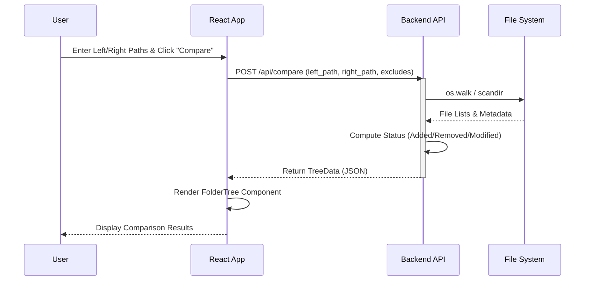
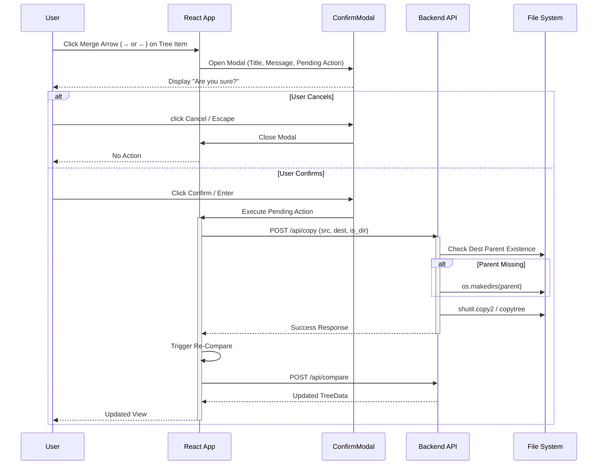
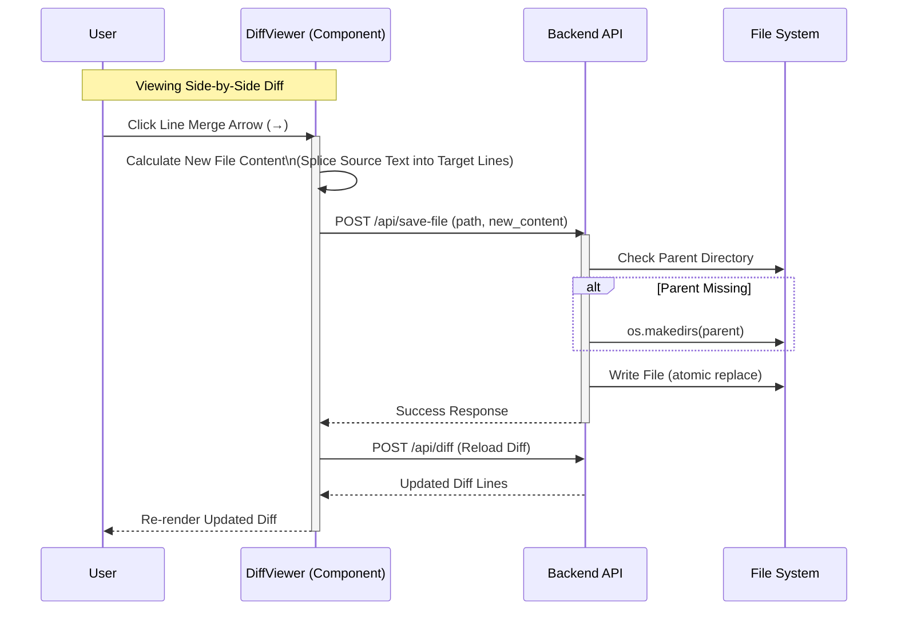

# Sequence Diagrams

These diagrams detail the interactions between the User, React Frontend, and Python Backend for key operations.

## 1. Comparison Workflow

## 2. Folder/File Merge Workflow (with Confirmation)

## 3. Line-Level Merge Workflow (Instant Action)

