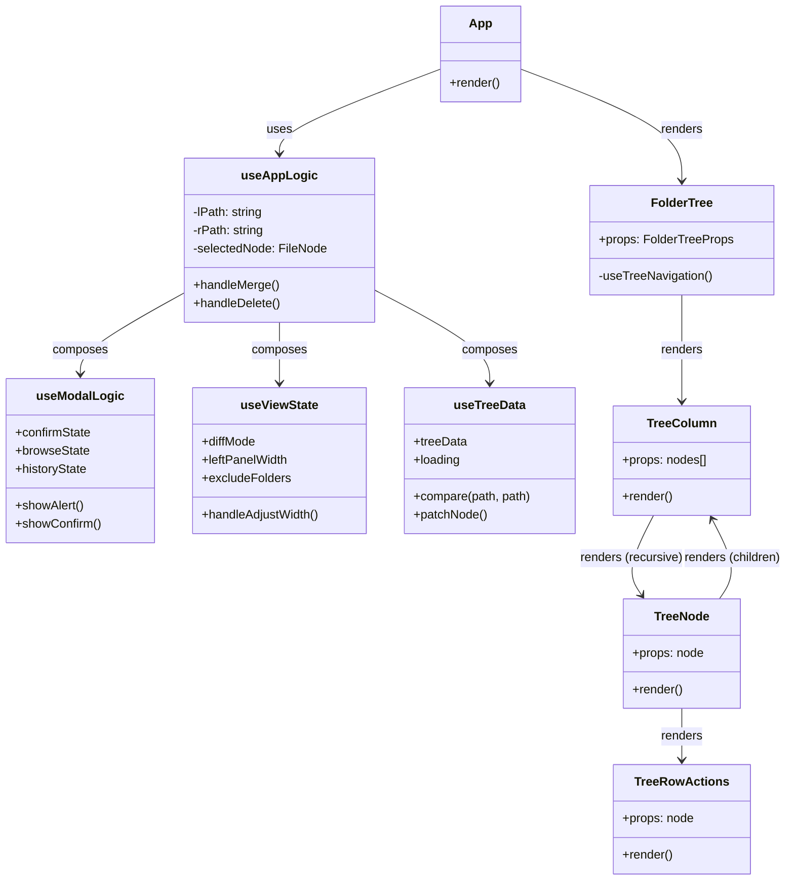

# System Class Diagram (v4)

```mermaid
classDiagram
    %% Core View Component
    class App {
        +render()
    }
    
    %% Orchestrator Hook
    class useAppLogic {
        -lPath: string
        -rPath: string
        -selectedNode: FileNode
        +handleMerge()
        +handleDelete()
    }

    %% Decomposed Logic
    class useModalLogic {
        +confirmState
        +browseState
        +historyState
        +showAlert()
        +showConfirm()
    }

    class useViewState {
        +diffMode
        +leftPanelWidth
        +excludeFolders
        +handleAdjustWidth()
    }

    class useTreeData {
        +treeData
        +loading
        +compare(path, path)
        +patchNode()
    }

    %% Component Tree
    class FolderTree {
        +props: FolderTreeProps
        -useTreeNavigation()
    }

    class TreeColumn {
        +props: nodes[]
        +render()
    }

    class TreeNode {
        +props: node
        +render()
    }

    class TreeRowActions {
        +props: node
        +render()
    }

    %% Relationships
    App --> useAppLogic : uses
    App --> FolderTree : renders

    useAppLogic --> useModalLogic : composes
    useAppLogic --> useViewState : composes
    useAppLogic --> useTreeData : composes

    FolderTree --> TreeColumn : renders
    TreeColumn --> TreeNode : renders (recursive)
    TreeNode --> TreeRowActions : renders
    TreeNode --> TreeColumn : renders (children)
```
