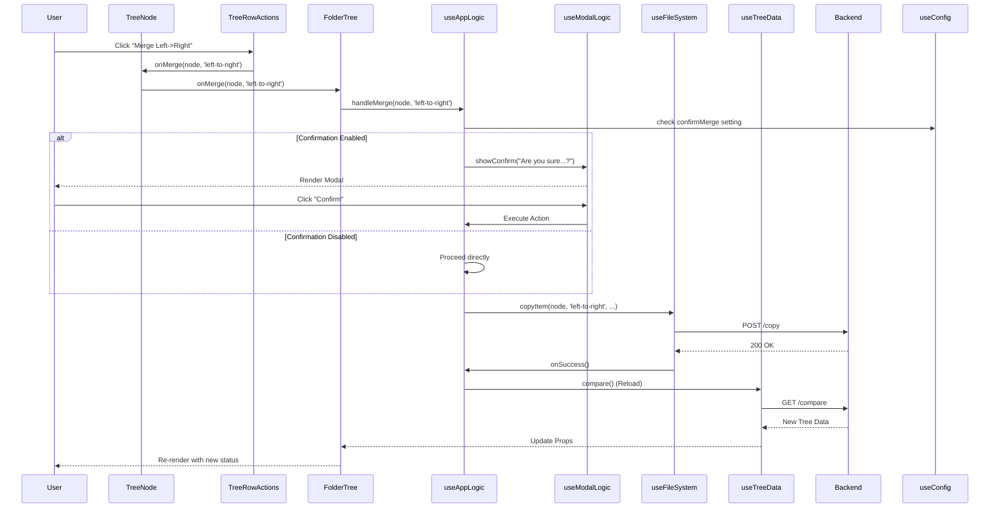

# Merge Operation Sequence (v4)

```mermaid
sequenceDiagram
    participant User
    participant TreeNode
    participant TreeRowActions
    participant FolderTree
    participant useAppLogic
    participant useModalLogic
    participant useFileSystem
    participant useTreeData
    participant Backend

    User->>TreeRowActions: Click "Merge Left->Right"
    TreeRowActions->>TreeNode: onMerge(node, 'left-to-right')
    TreeNode->>FolderTree: onMerge(node, 'left-to-right')
    FolderTree->>useAppLogic: handleMerge(node, 'left-to-right')
    
    useAppLogic->>useConfig: check confirmMerge setting
    
    alt Confirmation Enabled
        useAppLogic->>useModalLogic: showConfirm("Are you sure...?")
        useModalLogic-->>User: Render Modal
        User->>useModalLogic: Click "Confirm"
        useModalLogic->>useAppLogic: Execute Action
    else Confirmation Disabled
        useAppLogic->>useAppLogic: Proceed directly
    end

    useAppLogic->>useFileSystem: copyItem(node, 'left-to-right', ...)
    useFileSystem->>Backend: POST /copy
    Backend-->>useFileSystem: 200 OK
    
    useFileSystem->>useAppLogic: onSuccess()
    useAppLogic->>useTreeData: compare() (Reload)
    useTreeData->>Backend: GET /compare
    Backend-->>useTreeData: New Tree Data
    
    useTreeData-->>FolderTree: Update Props
    FolderTree-->>User: Re-render with new status
```
