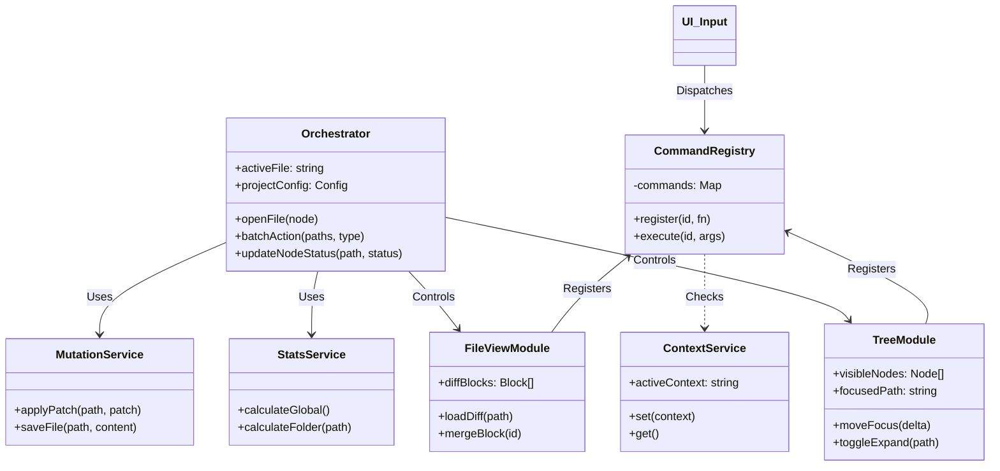
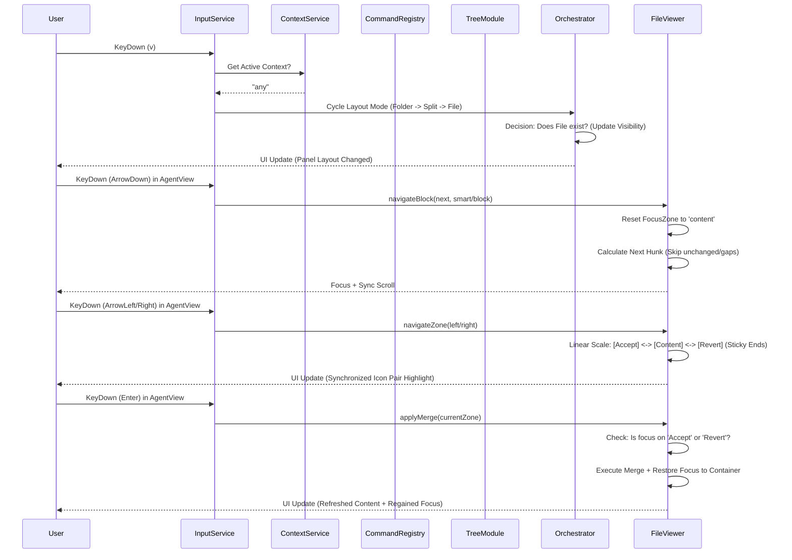
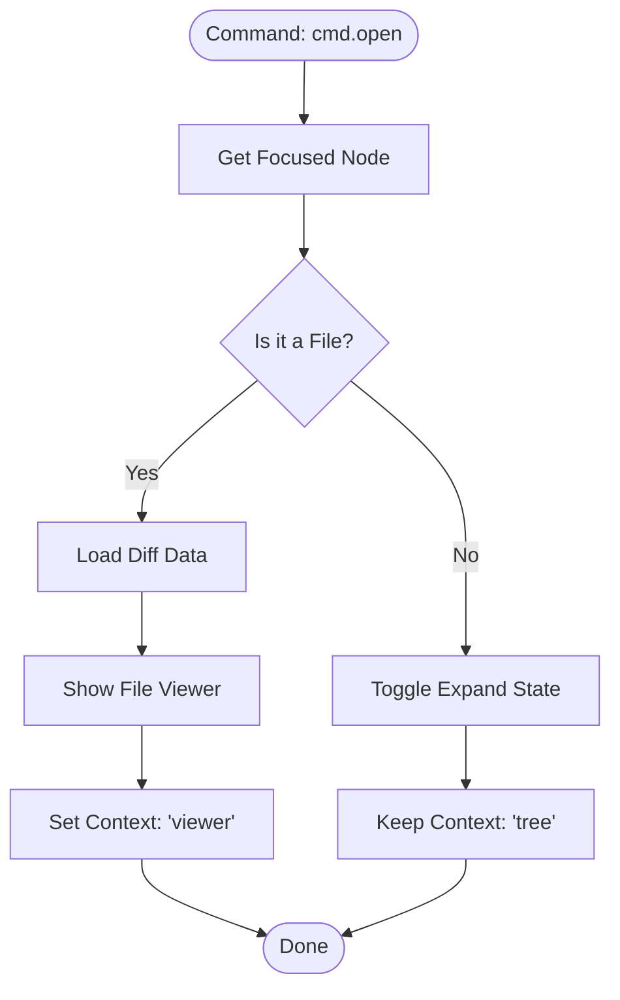
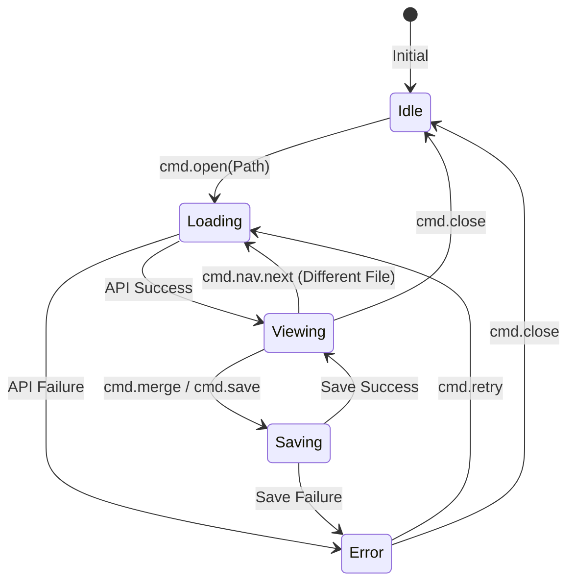
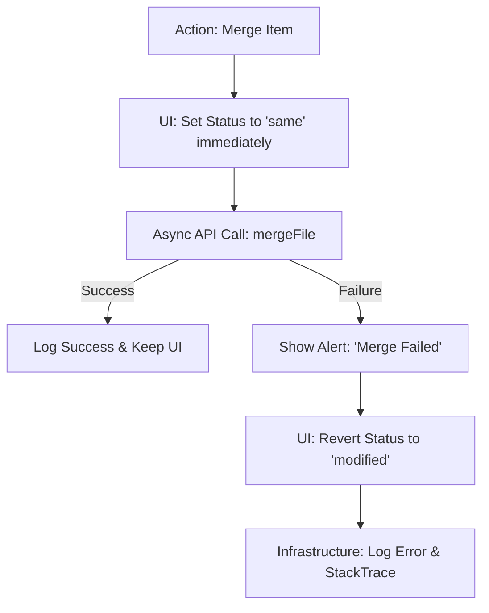
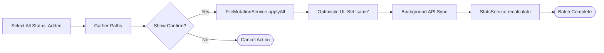

# Architecture Design Visuals (v6)

v6 아키텍처의 핵심 구조와 흐름을 시각화한 문서입니다.

---

## 1. Class Diagram (Module Structure)
모듈 간의 책임 분리(Separation of Concerns)와 의존성 관계를 보여줍니다.

---

## 2. Sequence Diagram (Command Flow)
키보드 입력이 어떻게 추상화되어 실제 액션으로 이어지는지 보여줍니다.

---

## 3. Flowchart: File Opening Decision Logic
폴더와 파일을 구분하여 처리하는 `Orchestrator`의 정책 결정 흐름입니다.

---

## 4. State Machine: Viewer Lifecycle
뷰어의 내부 상태 전이와 이에 따른 UI 정책을 정의합니다.

---

## 5. Detailed Logic: Optimistic Update with Rollback
네트워크 지연을 숨기고 즉각적인 피드백을 주되, 실패 시 안전하게 복구하는 로직입니다.

---

## 6. Data Schema: Core Types (Conceptual v6)
기존 `types.ts`를 보강한 v6 내부 데이터 구조입니다.

| Type Name | Property | Description |
| :--- | :--- | :--- |
| **WorkspaceState** | `activeFile` | 현재 포커스된 파일 경로 (nullable). |
| | `selectionSet` | 다중 선택된 경로들의 ID (Set&lt;string&gt;). |
| | `isBusy` | 전역 로딩 상태 (배치 작업 중 등). |
| **EnhancedNode** | `id` | 전체 경로 기반 고유 ID. |
| | `visible` | 필터링 결과에 따른 노출 여부. |
| | `meta` | `{ added: n, removed: m }` 등 통계 정보 캐시. |
| **Command** | `id` | 커맨드 고유 식별자 (예: `tree.expand`). |
| | `handler` | 실행될 함수. |
| | `enabled` | 현재 컨텍스트에서 실행 가능한지 판단 함수. |

---

## 7. Batch Action Error Handling Strategy
수백 개의 파일을 처리하다 중간에 에러가 났을 때의 대응 로직입니다.

1.  **Atomic Attempt**: 가급적 백엔드에서 트랜잭션 처리를 시도합니다.
2.  **Partial Success Tracking**: 실패한 파일 목록만 따로 수집하여 사용자에게 "N개 중 M개 실패"라고 알립니다.
3.  **UI Sync**: 성공한 항목은 유지하고, 실패한 항목만 원래 상태로 롤백(Rollback)하여 사용자가 재시도할 수 있게 합니다.

---

## 8. Flowchart: Batch Action Flow
여러 파일에 대해 일괄 처리를 수행하고 UI를 최적화하여 갱신하는 흐름입니다.

