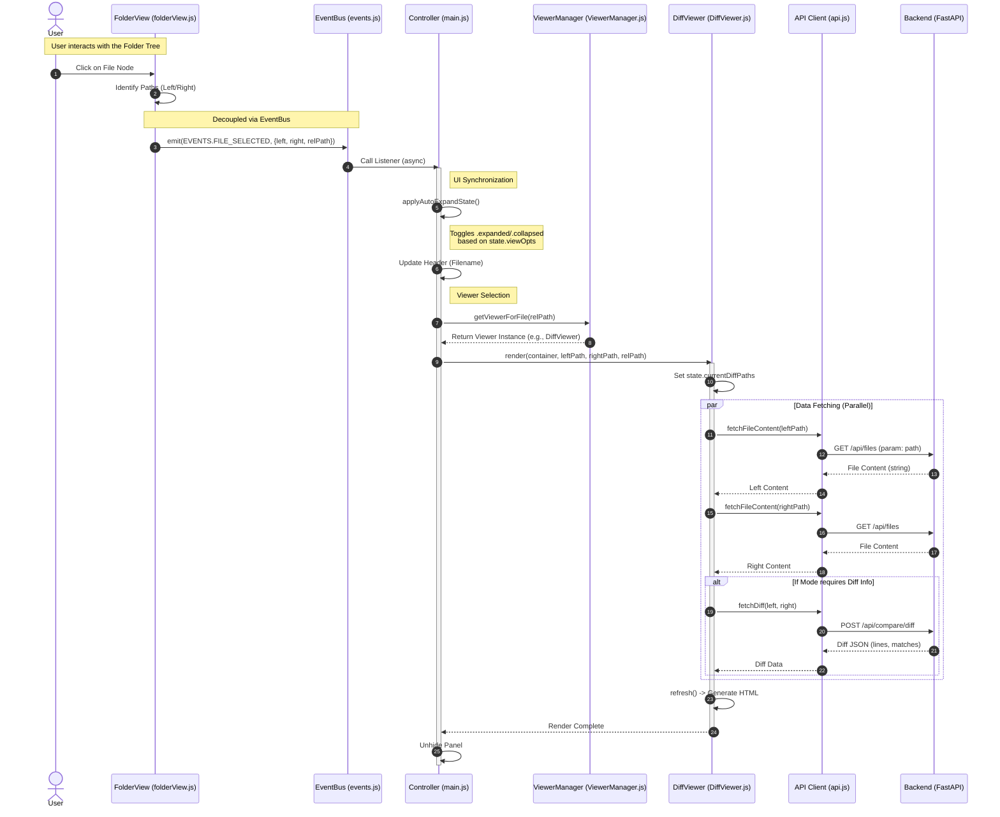

# Sequence Diagram: File Selection & Viewing Flow

This diagram details the interaction between the User, Frontend Components, and the Backend API when a file is selected for comparison.

```mermaid
sequenceDiagram
    autonumber
    
    actor User
    participant FV as FolderView (folderView.js)
    participant EB as EventBus (events.js)
    participant Main as Controller (main.js)
    participant VM as ViewerManager (ViewerManager.js)
    participant DV as DiffViewer (DiffViewer.js)
    participant API as API Client (api.js)
    participant BE as Backend (FastAPI)

    Note over User, FV: User interacts with the Folder Tree

    User->>FV: Click on File Node
    FV->>FV: Identify Paths (Left/Right)
    
    Note over FV, EB: Decoupled via EventBus
    FV->>EB: emit(EVENTS.FILE_SELECTED, {left, right, relPath})
    
    EB->>Main: Call Listener (async)
    
    activate Main
        Note right of Main: UI Synchronization
        Main->>Main: applyAutoExpandState()
        note right of Main: Toggles .expanded/.collapsed<br/>based on state.viewOpts
        
        Main->>Main: Update Header (Filename)
        
        Note right of Main: Viewer Selection
        Main->>VM: getViewerForFile(relPath)
        VM-->>Main: Return Viewer Instance (e.g., DiffViewer)
        
        Main->>DV: render(container, leftPath, rightPath, relPath)
        
        activate DV
            DV->>DV: Set state.currentDiffPaths
            
            par Data Fetching (Parallel)
                DV->>API: fetchFileContent(leftPath)
                API->>BE: GET /api/files (param: path)
                BE-->>API: File Content (string)
                API-->>DV: Left Content
                
                DV->>API: fetchFileContent(rightPath)
                API->>BE: GET /api/files
                BE-->>API: File Content
                API-->>DV: Right Content
                
                alt If Mode requires Diff Info
                    DV->>API: fetchDiff(left, right)
                    API->>BE: POST /api/compare/diff
                    BE-->>API: Diff JSON (lines, matches)
                    API-->>DV: Diff Data
                end
            end
            
            DV->>DV: refresh() -> Generate HTML
            DV-->>Main: Render Complete
        deactivate DV
        
        Main->>Main: Unhide Panel
    deactivate Main
```
