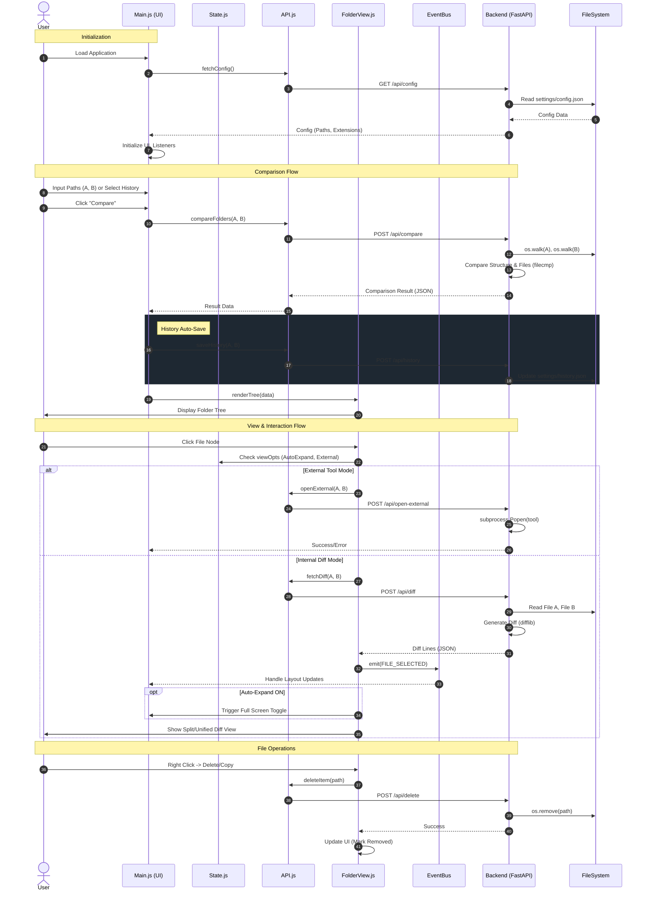

# System Sequence Diagram

This diagram details the interaction flow between the User, Frontend Components, API Layer, and Backend System.

```mermaid
sequenceDiagram
    autonumber
    
    actor User
    participant Main as Main.js (UI)
    participant State as State.js
    participant API as API.js
    participant FV as FolderView.js
    participant Event as EventBus
    participant BE as Backend (FastAPI)
    participant FS as FileSystem

    Note over User, Main: Initialization
    User->>Main: Load Application
    Main->>API: fetchConfig()
    API->>BE: GET /api/config
    BE->>FS: Read settings/config.json
    FS-->>BE: Config Data
    BE-->>Main: Config (Paths, Extensions)
    Main->>Main: Initialize UI, Listeners

    Note over User, BE: Comparison Flow
    User->>Main: Input Paths (A, B) or Select History
    User->>Main: Click "Compare"
    Main->>API: compareFolders(A, B)
    API->>BE: POST /api/compare
    BE->>FS: os.walk(A), os.walk(B)
    BE->>BE: Compare Structure & Files (filecmp)
    BE-->>API: Comparison Result (JSON)
    API-->>Main: Result Data
    
    rect rgb(30, 40, 50)
        Note right of Main: History Auto-Save
        Main->>API: saveHistory(A, B)
        API->>BE: POST /api/history
        BE->>FS: Update settings/history.json
    end

    Main->>FV: renderTree(data)
    FV->>User: Display Folder Tree
    
    Note over User, BE: View & Interaction Flow
    User->>FV: Click File Node
    FV->>State: Check viewOpts (AutoExpand, External)
    
    alt External Tool Mode
        FV->>API: openExternal(A, B)
        API->>BE: POST /api/open-external
        BE->>BE: subprocess.Popen(tool)
        BE-->>Main: Success/Error
    else Internal Diff Mode
        FV->>API: fetchDiff(A, B)
        API->>BE: POST /api/diff
        BE->>FS: Read File A, File B
        BE->>BE: Generate Diff (difflib)
        BE-->>FV: Diff Lines (JSON)
        FV->>Event: emit(FILE_SELECTED)
        Event-->>Main: Handle Layout Updates
        
        opt Auto-Expand ON
            FV->>Main: Trigger Full Screen Toggle
        end
        
        FV->>User: Show Split/Unified Diff View
    end

    Note over User, BE: File Operations
    User->>FV: Right Click -> Delete/Copy
    FV->>API: deleteItem(path)
    API->>BE: POST /api/delete
    BE->>FS: os.remove(path)
    BE-->>FV: Success
    FV->>FV: Update UI (Mark Removed)
```
