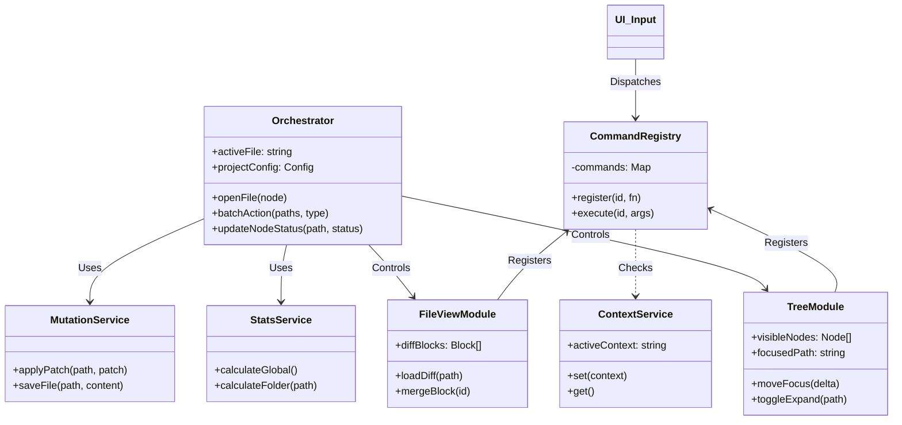
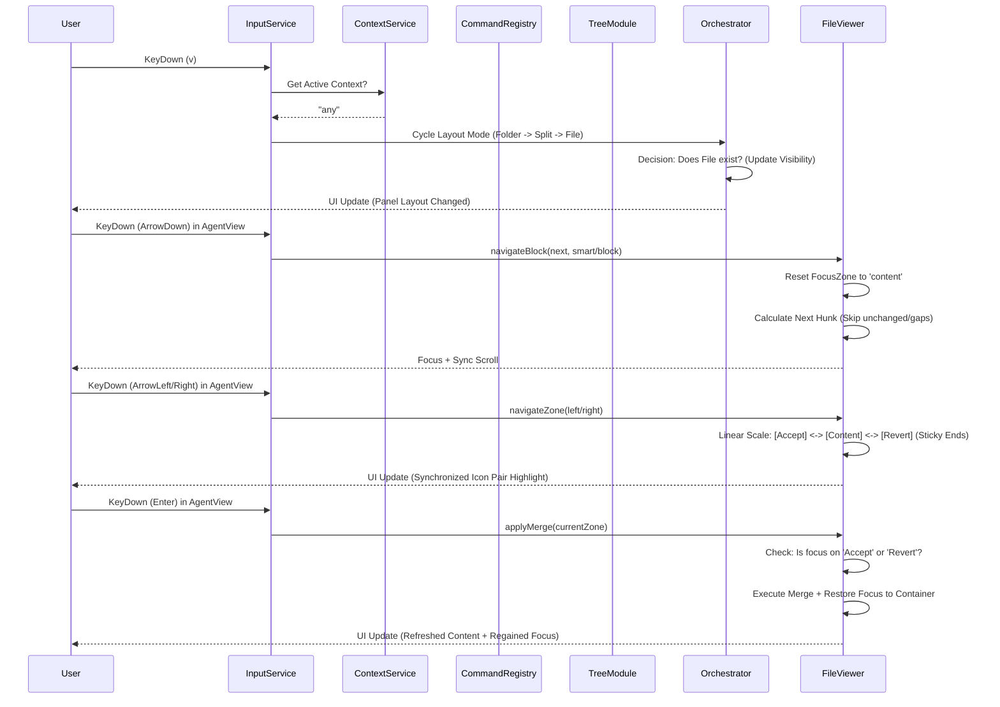
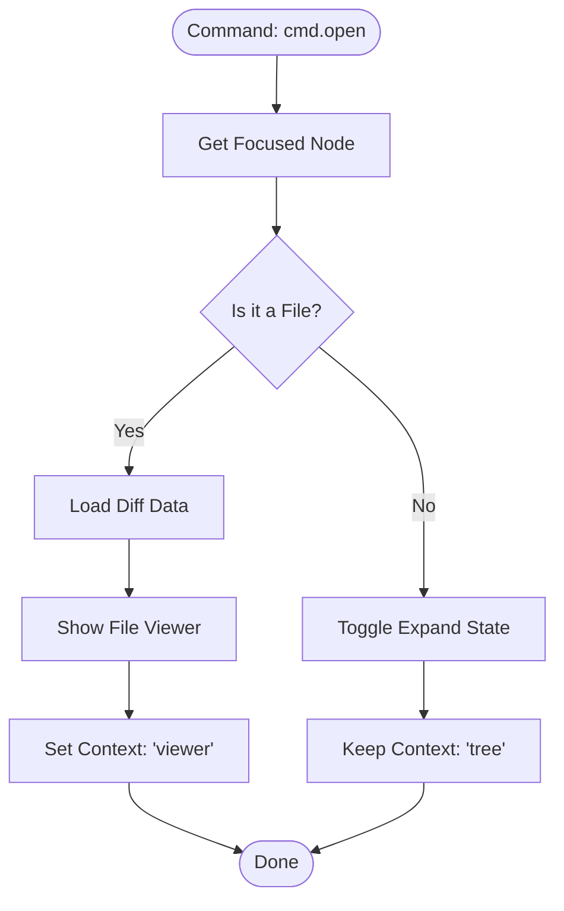
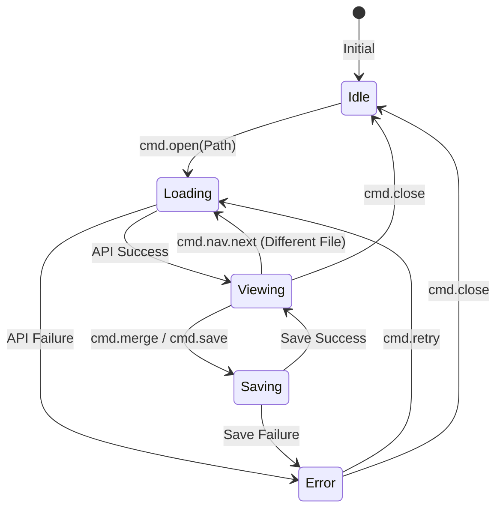
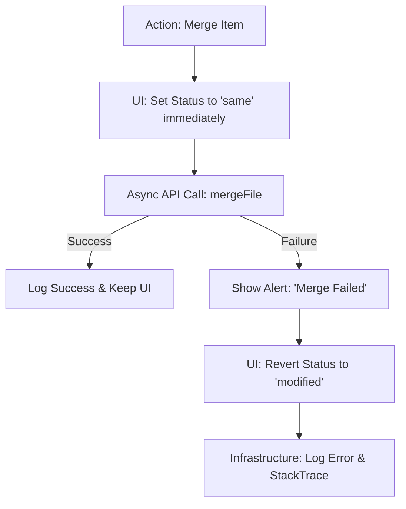
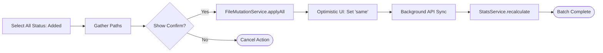

# Architecture Design Visuals (v7)

Documents visualizing the core structure and flow of the v7 architecture.

---

## 1. Class Diagram (Module Structure)
Shows the separation of concerns and dependency relationships between modules.

---

## 2. Sequence Diagram (Command Flow)
Shows how keyboard input is abstracted and leads to actual actions.

---

## 3. Flowchart: File Opening Decision Logic
Policy decision flow of the `Orchestrator` for handling folders and files separately.

---

## 4. State Machine: Viewer Lifecycle
Defines internal state transitions of the viewer and corresponding UI policies.

---

## 5. Detailed Logic: Optimistic Update with Rollback
Logic to hide network delay and provide immediate feedback, with safe recovery on failure.

---

## 6. UI Component: Toolbar & Settings Menu Structure

The toolbar consists of three main settings menus to achieve efficient space allocation and logical grouping.

| Menu Category | Key Features & Controls |
| :--- | :--- |
| **App Settings** | Global layout control, panel layout switching, tree width locking, full screen, auto-scroll, **Pane Widths** (numeric input per Split/Unified/Flat). |
| **Folder Options** | Folder tree specific filtering (A/M/R/S), Selection Box exposure mode (Hide/Smart/Show icons), Status Display Mode (TAG/TEXT/BOTH). |
| **File Options** | Viewer specific settings (Line numbers, Word wrap), Merge mode (Unit/Group), Filtering changes per line. |

**Design Principles**:
- **Persistence**: Pane Width is independently saved and restored for each `folderViewMode`.
- **Iconic UX**: Uses icon-based Segmented Controls instead of text switches to save space and increase visual recognition.
- **Robust Toggling**: Ensures one-click operation by applying clear defaults even in the initial state where settings are not defined.

---

## 7. Data Schema: Core Types (Conceptual v7)
Data structures internal to v7, reinforcing the existing `types.ts`.

| Type Name | Property | Description |
| :--- | :--- | :--- |
| **WorkspaceState** | `activeFile` | Currently focused file path (nullable). |
| | `selectionSet` | IDs of multi-selected paths (Set&lt;string&gt;). |
| | `isBusy` | Global loading state (during batch operations, etc.). |
| **EnhancedNode** | `id` | Unique ID based on full path. |
| | `visible` | Visibility based on filtering results. |
| | `meta` | Cache for statistical information like `{ added: n, removed: m }`. |
| **Command** | `id` | Unique identifier for the command (e.g., `tree.expand`). |
| | `handler` | Function to be executed. |
| | `enabled` | Function to determine if it's executable in the current context. |

---

## 8. Batch Action Error Handling Strategy
Handling logic when an error occurs while processing hundreds of files.

1.  **Atomic Attempt**: Try to handle as a transaction on the backend whenever possible.
2.  **Partial Success Tracking**: Collect only the list of failed files and separately inform the user (e.g., "M out of N failed").
3.  **UI Sync**: Keep successful items and rollback only failed items to their original state so the user can retry.

---

## 9. Flowchart: Batch Action Flow
Flow for performing batch processing on multiple files and updating the UI optimally.

